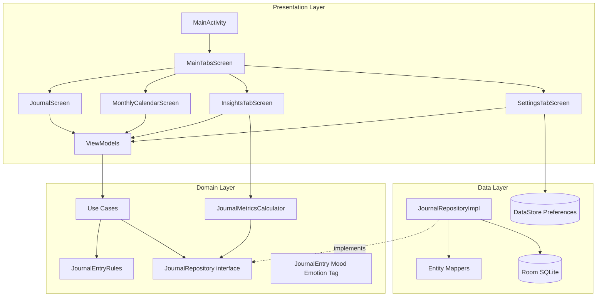

# MoodScribbles

**MoodScribbles** is a native Android journal for tracking emotional well-being over time. Log mood, energy, emotions, tags, and short notes once per day, then explore patterns through a monthly calendar, statistics dashboard, and searchable history—all stored locally on the device.

The app is built as an MVP following a **30-day delivery plan**, with a focus on clean layering, predictable UI state, and room to grow into notifications, biometrics, widgets, and export.

---

## Table of contents

- [Features](#features)
- [System design](#system-design)
- [Architecture](#architecture)
- [Tech stack](#tech-stack)
- [Project structure](#project-structure)
- [Data model](#data-model)
- [Navigation](#navigation)
- [Getting started](#getting-started)
- [References & Inspiration](#references--inspiration)

---

## Features

### Implemented (MVP core)

| Area | Description |
|------|-------------|
| **Daily journal** | One primary entry per calendar day: mood (5 levels), energy (0–100), emotion, optional title/notes, and custom or suggested tags. |
| **Create & edit** | Full create/update flow with domain validation (`JournalEntryRules`), optimistic UI state, and reload after save. |
| **Monthly calendar** | Month grid with mood tint and emoji per day; navigate months; open day detail or jump to journal for a date. |
| **Day detail** | Read-only summary for a selected day; shortcut to edit the entry. |
| **Insights / statistics** | Dashboard with average mood and energy, mood trend (line chart), emotion mix (horizontal bars), energy distribution (semi-circular gauge). Period filter: by month or last 30 days. |
| **History** | Chronological list of entries for the selected period, linked to day detail. |
| **Settings** | Theme preference (System / Light / Dark) persisted in DataStore; shortcut to journal; About dialog with app version; placeholders for notifications and biometric lock. |
| **Localization** | English and Portuguese (`values` / `values-pt`). |

### Planned (roadmap)

- Daily configurable reminders (WorkManager + notification settings)
- Biometric app lock
- Home-screen widget with quick entry
- PDF export and share
- Local backup and restore

---

## System design

High-level flow: **UI events** drive **ViewModels**, which call **use cases**; use cases enforce rules and delegate persistence to **repositories**; repositories coordinate **Room** and **DataStore** inside transactions where needed.



### Design principles

- **Single source of truth per day** — At most one journal row per `entry_date` (unique index in Room).
- **Unidirectional UI state** — ViewModels expose `StateFlow` / `Flow`; screens send sealed `UiEvent` types (e.g. `JournalUiEvent`).
- **Domain-first validation** — Create/update rules live in `JournalEntryRules`; use cases return explicit `Result` types instead of throwing for business failures.
- **Reactive reads** — Calendar, history, and insights observe date-range queries via `Flow` and map entities to domain models inside repository transactions.
- **Offline-first** — All journal data stays on device; no network layer in the current MVP.

---

## Architecture

The codebase follows **Clean Architecture** with **MVVM** on the presentation side, aligned with [Android’s Guide to App Architecture](https://developer.android.com/topic/architecture).

| Layer | Package | Responsibility |
|-------|---------|----------------|
| **UI** | `ui.*` | Jetpack Compose screens, theme, navigation hosts, `UiState` / `UiEvent` models |
| **Domain** | `domain.*` | Entities, repository contracts, use cases, business rules, metrics calculators |
| **Data** | `data.*` | Room entities/DAOs, repository implementations, mappers, DataStore preferences |
| **Core** | `core.di` | Koin module wiring (`AppModule`) |

### Presentation (MVVM)

- **ViewModels** — `JournalViewModel`, `CalendarViewModel`, `CalendarDayDetailViewModel`, `JournalHistoryViewModel`, `SettingsViewModel`
- **State** — Immutable `*UiState` data classes; loading/saving/error flags where relevant
- **Events** — User actions modeled as events (e.g. `JournalUiEvent.SaveClicked`) handled in one `onEvent` entry point

### Domain

- **Use cases** — `CreateJournalEntryUseCase`, `UpdateJournalEntryUseCase`, `GetJournalEntryByDateUseCase`, `ObserveDashboardMetricsUseCase`
- **Metrics** — `JournalMetricsCalculator` builds `DashboardMetrics` (trend points, emotion frequencies, energy buckets) from a list of entries
- **Rules** — Energy range, timestamp consistency, one-entry-per-day on create, existence check on update

### Data

- **Room** — `AppDatabase` (version 1): `journal_entries`, `emotions`, `tags`, `entry_tag_cross_ref`
- **Repository** — `JournalRepositoryImpl` resolves emotion/tag IDs, replaces tag cross-refs on save, maps rows to `JournalEntry`
- **Preferences** — `ThemePreferenceRepository` stores `ThemeMode` (`SYSTEM` | `LIGHT` | `DARK`)

Dependency injection is handled with **Koin** (`MoodScribblesApplication` + `appModule`).

---

## Tech stack

| Category | Choice |
|----------|--------|
| Language | Kotlin 2.2.10 |
| UI | Jetpack Compose, Material 3 (BOM 2024.09.00) |
| Architecture | MVVM + Clean Architecture (data / domain / ui) |
| DI | Koin 4.0.2 |
| Persistence | Room 2.7.2 (KSP), DataStore Preferences 1.1.7 |
| Navigation | Navigation Compose 2.9.6 |
| Async | Kotlin Coroutines, `Flow`, `StateFlow` |
| Background (ready) | WorkManager 2.10.5 (not yet used for reminders) |
| Min / target SDK | 24 / 36 |
| Build | AGP 9.1.1, compileSdk 36 |

---

## Project structure

```
app/src/main/java/com/example/moodscribbles/
├── core/di/                 # Koin AppModule
├── data/
│   ├── local/               # Room database, entities, DAOs
│   ├── mapper/              # Entity ↔ domain mappers
│   ├── preferences/         # Theme DataStore
│   └── repository/          # JournalRepositoryImpl
├── domain/
│   ├── metrics/             # Dashboard models & calculator
│   ├── repository/          # JournalRepository interface
│   └── usecase/             # Application use cases
├── ui/
│   ├── calendar/            # Month grid, day detail
│   ├── history/             # History list row & ViewModel (insights tab)
│   ├── insights/            # Dashboard UI
│   ├── journal/             # Journal form screen
│   ├── settings/            # Settings tab
│   ├── prototype/           # Visual prototypes (reference only)
│   └── theme/               # Material theme & dynamic color
└── MoodScribblesApplication.kt
```

Prototype composables under `ui/prototype/` are **design references**; the main user journey uses the functional screens above.

---

## Data model

### Domain (`JournalEntry`)

- **Identity** — `id`, `date` (`LocalDate`)
- **Well-being** — `mood` (`Mood` enum), `energyLevel` (0–100), `emotion` (`Emotion`)
- **Context** — `tags: List<Tag>`, optional `title`, `description`
- **Audit** — `createdAt`, `updatedAt` (`Instant`)

### Persistence

- **Journal** — One row per day in `journal_entries` (FK to `emotions`)
- **Tags** — Normalized `tags` table; many-to-many via `entry_tag_cross_ref` (CASCADE on delete)
- **Uniqueness** — Unique index on `entry_date` prevents duplicate daily entries

---

## Navigation

- **Root** — `MainActivity` hosts a `NavHost`
- **Tabs** — `MainTabsScreen`: Home (calendar), Insights (dashboard + history), Settings
- **Full-screen routes** — Day detail (`calendar_day_detail/{date}`), functional journal (`functional_journal?date={date}`)

Theme is applied at the activity root via `MoodScribblesAppTheme`, reading `ThemePreferenceRepository` so changes in Settings apply app-wide.

---

## Getting started

### Requirements

- Android Studio (recent stable) with SDK 36
- JDK 11+
- Android device or emulator API 24+

### Build & run

```bash
# From the project root
./gradlew :app:assembleDebug

# Or open in Android Studio and Run 'app'
```

### Compile checks

```bash
./gradlew :app:compileDebugKotlin
./gradlew test
```

---

## References & Inspiration

- [Android-Clean-Architecture-MVVM-Kotlin](https://github.com/samadtalukder/Android-Clean-Architecture-MVVM-Kotlin)
  by @samadtalukder — used as structural reference for the Clean Architecture
  layering (data/domain/ui) and MVVM pattern setup.

- [iPhone's native Mood Tracker](https://www.apple.com/ios/health/) — the main
  product inspiration for this app. Apple's emotion and mood logging experience
  inside the Health app influenced the core concept of tracking emotional state
  over time in a simple and frictionless way.

- [Guide to App Architecture](https://developer.android.com/topic/architecture)
  — Android's official architecture guidelines, used as the foundation for
  structuring the app's layers, managing UI state, and following recommended
  patterns for separation of concerns.

---

## License

This project is under active development as a learning / MVP build. A license file will be added when it is published to the Play Store
